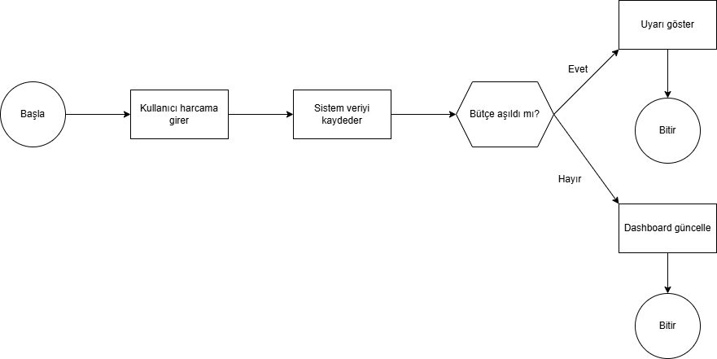

# Harcama Analizi Dashboardu

Bu proje, kullanıcıların harcama verilerini analiz edebileceği bir veri analizi çalışmasıdır.
Proje kapsamında SQL kullanılarak veri tabanı oluşturulmuş ve Power BI ile veriler görselleştirilmiştir.

## Proje Özeti

Bu dashboard ile kullanıcıların harcamaları aşağıdaki başlıklarda analiz edilmektedir:

* Toplam harcama
* Kategori bazlı harcama dağılımı
* Kullanıcı bazlı harcama analizi
* Zaman bazlı harcama değişimi

## Kullanılan Teknolojiler

* SQL Server
* Power BI
* DAX

## Veri Yapısı ve SQL

Projede veri tabanı SQL kullanılarak oluşturulmuş ve aşağıdaki işlemler gerçekleştirilmiştir:

* Tablo oluşturma (CREATE TABLE)
* Veri ekleme (INSERT)
* Veri analizi (SELECT, JOIN, GROUP BY)

Detaylı SQL sorguları `queries.sql` dosyasında yer almaktadır.

## Özellikler

* İnteraktif filtreleme (Slicer)
* Dinamik veri analizi
* Kullanıcı ve kategori bazlı analiz
* Zaman bazlı trend analizi

## Proje Dosyaları

* personal-expense-dashboard.pbix → Power BI dashboard dosyası
* queries.sql → SQL sorguları
* dashboard.png → Dashboard ekran görüntüsü
* harcama-analizi-raporu.pdf → Proje raporu

##  Amaç

Bu proje, veri analizi sürecinin veri toplama, işleme ve görselleştirme aşamalarını göstermek amacıyla hazırlanmıştır.

## Dashboard Görseli

## Diyagram Görseli

