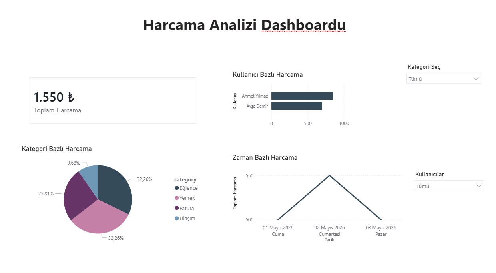

# Harcama Analizi Dashboardu

Bu proje, Power BI kullanılarak oluşturulmuş kişisel harcama analiz dashboardudur.

## Proje Özeti

Bu dashboard ile kullanıcıların harcamaları:

* Toplam harcama
* Kategori bazlı dağılım
* Kullanıcı bazlı analiz
* Zaman bazlı değişim

görselleştirilmiştir.

## Kullanılan Teknolojiler

* Power BI
* SQL
* DAX

## Proje Dosyaları

* `personal-expense-dashboard.pbix` → Dashboard dosyası
* `queries.sql` → Veri hazırlama SQL sorguları
* `dashboard.png` → Dashboard ekran görüntüsü

## Özellikler

* İnteraktif filtreleme (Slicer)
* Dinamik veri analizi
* Kullanıcı ve kategori bazlı analiz

## Dashboard Görseli

